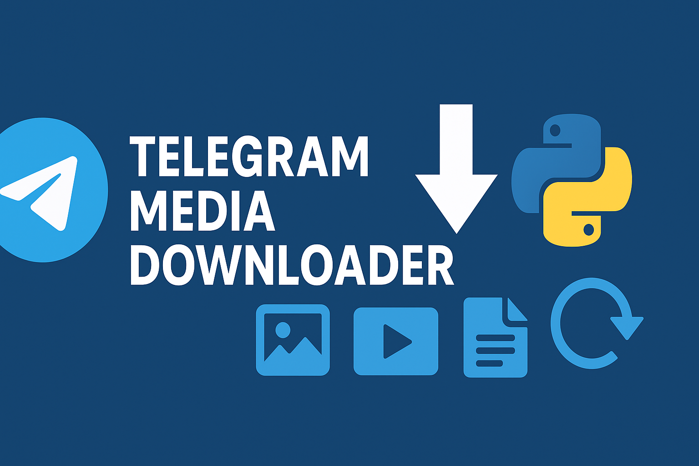

<div align="center">


[](QUICK_START.md)
[](README.md)
[](https://github.com/1BitCode-Com/telegrab/issues)

</div>

---

# TeleGrab: The Ultimate Telegram Archiver

TeleGrab: The Ultimate Telegram Channel & Group Archiver. Designed to grab every photo, video, and document, bypassing API limits and handling expired links with ease.

## Features

### Core Features
- **Robust Parallel Downloads**: Stably download from multiple workers at once without errors.
- **Smart Error Handling**: Automatically handles `FloodWait` and `File reference expired` errors.
- **Chunk-Based Throttling**: Downloads files in small chunks with configurable delays to avoid API bans.
- **Intelligent State Management**: Never lose progress. Accurately resumes from the last fully downloaded file.
- **Automatic Cleanup**: Removes empty files from failed downloads.
- **Human-like Behavior**: Staggered downloads and other techniques to mimic a human user.
- **Account Type Support**: Optimized settings for both free and premium accounts.

### Advanced Features
- **Concurrent Downloads**: Download multiple files simultaneously.
- **Password Protection**: Support for password-protected channels.
- **CSV Export**: Export download reports to CSV format.
- **State Encryption**: Secure state file encryption for privacy.
- **Duplicate File Handling**: Overwrite or create unique names for existing files.

## Quick Start

### Prerequisites
- Python 3.8 or higher
- Telegram account (free or premium)
- API credentials from [my.telegram.org](https://my.telegram.org)

### Installation

1. **Clone or download the project:**
```bash
git clone https://github.com/1BitCode-Com/telegrab.git
cd telegrab
```

2. **Install dependencies:**
```bash
pip install -r requirements.txt
```

3. **Run the interactive setup:**
```bash
python3 run.py
```

## Configuration

### Basic Configuration

Edit `config.json` to customize settings. Here is a full example:

```json
{
  "api_id": "YOUR_API_ID",
  "api_hash": "YOUR_API_HASH",
  "session_name": "telegrab_session",
  "target_group": "https://t.me/example_channel",
  "download_dir": "downloads",
  "account_type": "premium",

  "rate_limit_delay": 5,
  "chunk_size_kb": 256,
  "chunk_delay_ms": 200,

  "overwrite_existing_files": false,
  "user_agents_enabled": true,
  
  "free_settings": {
    "max_concurrent": 1,
    "delay_between_batches": 15,
    "batch_size": 5
  },
  "premium_settings": {
    "max_concurrent": 10,
    "delay_between_batches": 10,
    "batch_size": 20
  }
}
```

### Key Configuration Options

- `account_type`: Set to `"premium"` or `"free"` to use the corresponding settings block.
- `max_concurrent`: The number of files to download in parallel.
- `chunk_size_kb`: The size of each file piece to download (e.g., 256KB).
- `chunk_delay_ms`: The delay in milliseconds after downloading each chunk (e.g., 200ms). This is critical for avoiding bans.

## Usage

### Command Line Usage

```bash
# Use target and settings from config.json
python3 telegrab.py

# Override target from command line
python3 telegrab.py --target "https://t.me/channel_name"

# Override account type
python3 telegrab.py --account-type "free"

# Override concurrent downloads
python3 telegrab.py --max-concurrent 1

# Overwrite existing files
python3 telegrab.py --overwrite

# Password protected channel
python3 telegrab.py --password "channel_password" --target "https://t.me/private_channel"
```

### Interactive Mode

```bash
# Start interactive setup
python3 run.py
```

## Troubleshooting

### Common Issues

#### `FloodWaitError` or `GetFileRequest` Errors
**Problem**: Telegram is rate-limiting your requests because they are too fast or aggressive.
**Solution**: 
- **Increase `chunk_delay_ms`**: This is the most effective solution. Try values like `500` or `1000`.
- **Reduce `max_concurrent`**: Lower the number of parallel downloads.
- **Increase `delay_between_batches`**: Slows down how fast the script iterates through messages.

#### `File reference has expired`
**Problem**: The temporary download link expired before the download could start.
**Solution**: This is automatically handled by the script in v2.0.0+. If you see this, ensure you are on the latest version.

#### Connection Issues
**Problem**: Network connectivity problems.
**Solution**:
- Check internet connection
- Verify API credentials
- Try a different `session_name` in `config.json`

## Development

### Project Structure
```
telegrab/
├── telegrab.py                   # Main script
├── run.py                        # Interactive runner
├── config.json                   # Configuration
├── requirements.txt              # Dependencies
├── logs/                         # Log files
└── downloads/                    # Downloaded files
```

### Contributing
1. Fork the repository
2. Create a feature branch
3. Make your changes
4. Submit a pull request

### Testing
```bash
# Run tests
python3 test_downloader.py
```

## License

This project is licensed under the MIT License - see the [LICENSE](LICENSE) file for details.

## Support

- **GitHub Issues**: Report bugs and request features
- **Documentation**: Check [QUICK_START.md](QUICK_START.md) for detailed guide
- **Security**: Report security issues privately

## Changelog

See [CHANGELOG.md](CHANGELOG.md) for a complete list of changes and updates.

---

<div align="center">

**Made with ❤️ by [1BitCode-Com](https://github.com/1BitCode-Com)**



</div>
